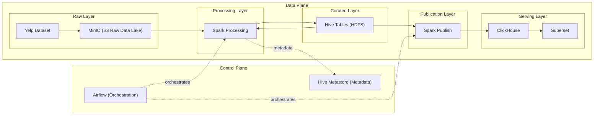

# DataLab — Local Data Platform Reference (Spark + Airflow + ClickHouse)

*A reproducible local stack for building and testing modern data pipelines.*

DataLab is a local reference implementation of a modern analytical data platform built with open-source components.

The project demonstrates how common data infrastructure systems can be combined into a reproducible end-to-end analytics stack running entirely on a local machine.

The entire platform can be started locally with a single command:

```bash
docker compose up -d
```


## Architecture TL;DR

DataLab implements a simplified analytical data platform that runs entirely locally.

```text
data/ → MinIO → Spark ↔ Hive Tables (HDFS) → ClickHouse → Superset
                     ↑
                   Airflow
```

Raw dataset files are uploaded to **MinIO (S3)**.  
**Spark** reads the data using the **S3A connector**, performs transformations, and writes results to:

- **Hive tables stored on HDFS** (structured / curated layer)
- **ClickHouse** (analytical serving layer)

Spark can both **write and read Hive tables**, enabling multi-stage data pipelines.

**Airflow** orchestrates Spark jobs, and **Superset** is used for data exploration and dashboards.

---

## Overview

DataLab is a local analytical data platform designed for experimenting with modern data stack components.

The platform implements an end-to-end analytical pipeline:

MinIO (S3) → Spark → Hive (HDFS) → ClickHouse → Superset

Spark workloads are executed as containerized jobs orchestrated by Airflow. Each Airflow task launches a Docker-based Spark client that submits the job to the Spark Standalone cluster using `spark-submit`.

The project focuses on reproducible local infrastructure, transparent data flows, and modular data pipelines that mirror patterns used in production data platforms.

---

## Key Features

- Fully local analytical platform deployed with Docker Compose
- Clear separation of raw, curated, and serving data layers
- Spark pipelines reading from MinIO and building Hive tables on HDFS
- Containerized Spark job execution orchestrated by Airflow
- Multi-stage processing model with curated-to-serving publication into ClickHouse
- Superset integration for dashboards and ad hoc analytics

---

## Architecture

The diagram below shows the logical layers of the platform.



---

## Job Execution Model

Spark workloads in DataLab are executed using a containerized execution model orchestrated by Airflow.

Airflow does not run Spark code directly. Instead, each Airflow task launches a short-lived Docker container that acts as a **Spark client**. This container submits the Spark application to the Spark Standalone cluster using `spark-submit`.

Execution flow:

Airflow Task → Docker Container (Spark Client) → spark-submit → Spark Cluster


This approach provides several benefits:

- **Execution isolation** — each job runs in an isolated container environment
- **Reproducibility** — the runtime environment is defined by the container image
- **Explicit job submission** — Spark applications are submitted via `spark-submit`
- **Production-like architecture** — similar execution patterns are used in many production data platforms

In this model:

- **Airflow** acts as the orchestration layer
- **Docker containers** provide an isolated runtime environment for each job
- **Spark Standalone** performs distributed data processing

---

## Spark Job Packaging

Spark applications in DataLab are implemented as standalone Python scripts located in the repository.

Airflow tasks reference these scripts and execute them inside the Spark client container using `spark-submit`.

This structure keeps Spark job logic separated from orchestration code and makes the pipeline easier to maintain and extend.

---

## Platform Components

The platform is composed of several logical layers commonly found in modern analytical systems.

### Raw Storage Layer

**MinIO (S3 compatible storage)**

- Stores raw dataset files
- Acts as the **raw data lake**
- Spark reads data using the S3A connector

### Processing Layer

**Apache Spark (Standalone Cluster)**

- Distributed processing engine
- Reads raw data from MinIO
- Performs transformations and aggregations
- Writes **curated datasets to Hive tables**
- Reads Hive tables for further processing stages
- Publishes analytical datasets to ClickHouse

### Curated Storage Layer

**Hive Tables (stored on HDFS)**

- Structured curated datasets produced by Spark
- Stored in the Hive warehouse directory on **HDFS**
- Act as an intermediate analytical layer

### Metadata Layer

**Hive Metastore**

- Stores metadata for Hive tables
- Maintains schemas and table locations
- Enables Spark and Hive to access structured datasets

**HiveServer2**

- SQL interface for Hive tables
- Used for schema initialization and validation

### Analytical Serving Layer

**ClickHouse**

- Columnar analytical database
- Stores analytical datasets for querying
- Optimized for OLAP workloads

### Orchestration Layer

**Apache Airflow**

- Schedules and orchestrates Spark jobs
- Manages pipeline execution
- Coordinates data processing tasks

### Visualization Layer

**Apache Superset**

- Connects to ClickHouse
- Provides dashboards and data exploration
- Used for analytics and visualization

---

## Data Pipeline

The platform processes data using the following pipeline:

1. **Dataset ingestion**  
   Raw Yelp dataset files (`business.json`, `review.json`) are placed in the local `data/` directory.

2. **Object storage bootstrap**  
   During platform startup, the `minio-init` container uploads the dataset into the MinIO bucket.

3. **Raw data storage**  
   Files are stored in the data lake using a structured layout:

```text
s3a://raw/yelp/business/full/business.json
s3a://raw/yelp/review/full/review.json
```

4. **Distributed processing**  
   Spark jobs read raw data from MinIO using the **S3A connector**.

5. **Curated layer creation**  
   Spark transforms raw datasets and writes structured tables into **Hive (stored on HDFS)**.

6. **Serving layer publication**  
   Spark publishes analytical datasets from the curated layer into **ClickHouse**.

7. **Analytics and visualization**  
   Superset connects to ClickHouse and provides dashboards for exploring the processed data.

---

## Project Goals

This project explores how a modern analytical platform can be assembled from open-source components.

Key goals:

- reproducible local data platform
- clear separation of **raw, curated, and serving layers**
- Spark-based data pipelines
- orchestration using Airflow
- analytical serving via ClickHouse
- BI layer using Superset

---

## Technology Stack

- Docker / Docker Compose
- Apache Spark
- Apache Hive Metastore
- HDFS
- MinIO (S3 compatible storage)
- Apache Airflow
- ClickHouse
- Apache Superset

---

## Dataset

This project uses the **Yelp Open Dataset** as a sample analytical workload.

Dataset source:

https://business.yelp.com/data/resources/open-dataset/

Required files:

```text
business.json
review.json
```

Place the files in the `data` directory in the repository root:

```text
data/
├── business.json
└── review.json
```

These files will be automatically uploaded to MinIO during platform bootstrap.

---

# Quick Start

1. Place dataset files in the repository:

```text
data/business.json
data/review.json
```

2. Start the platform

```bash
docker compose up -d
```

3. Verify services

```bash
docker compose ps
```

4. Initialize database schemas

Hive:

```bash
MSYS_NO_PATHCONV=1 docker compose exec hiveserver2 \
  beeline -u jdbc:hive2://localhost:10000/default \
  -f /workspace/ddl/01_hive_up.sql
```

ClickHouse:

```bash
MSYS_NO_PATHCONV=1 docker compose exec -T clickhouse \
  clickhouse-client --multiquery < ddl/02_clickhouse_up.sql
```

The platform is now ready for running Spark pipelines and exploring data in Superset.

---

# Prerequisites

Install:

- Docker
- Docker Compose

Verify installation:

```bash
docker --version
docker compose version
```

---

# Repository Structure

```text
datalab/
├── docker-compose.yml
├── .env
├── data
│   ├── business.json
│   └── review.json
├── ddl
│   ├── 01_hive_up.sql
│   └── 02_clickhouse_up.sql
├── airflow
│   ├── dags
│   └── jobs
├── spark
└── conf
```

---

# Verify Running Services

```bash
docker compose ps
```

---

# Check MinIO Bootstrap

The `minio-init` container prepares the object storage and uploads the initial dataset.

```bash
docker compose logs minio-init
```

---

# Service Endpoints

After the platform starts, the following services are available:

| Service | URL |
|--------|-----|
| MinIO API | http://localhost:9000 |
| MinIO Console | http://localhost:9001 |
| Spark Master UI | http://localhost:8081 |
| Airflow | http://localhost:8088 |
| Superset | http://localhost:8089 |
| ClickHouse HTTP | http://localhost:8123 |

---

# Default Credentials

| Service | Username | Password |
|--------|----------|----------|
| MinIO | minioadmin | minioadmin123 |
| Airflow | admin | admin |
| Superset | admin | admin |

---

# Initialize Database Schemas

The DDL scripts are located in the `ddl` directory:

```text
ddl/
├── 01_hive_up.sql
└── 02_clickhouse_up.sql
```

These scripts create the required databases and tables used by Spark jobs and Superset dashboards.

## Initialize Hive Schema

For Git Bash on Windows:

```bash
MSYS_NO_PATHCONV=1 docker compose exec hiveserver2 \
  beeline -u jdbc:hive2://localhost:10000/default \
  -f /workspace/ddl/01_hive_up.sql
```

For Linux/macOS:

```bash
docker compose exec hiveserver2 \
  beeline -u jdbc:hive2://localhost:10000/default \
  -f /workspace/ddl/01_hive_up.sql
```

## Initialize ClickHouse Schema

For Git Bash on Windows:

```bash
MSYS_NO_PATHCONV=1 docker compose exec -T clickhouse \
  clickhouse-client --multiquery < ddl/02_clickhouse_up.sql
```

For Linux/macOS:

```bash
docker compose exec -T clickhouse \
  clickhouse-client --multiquery < ddl/02_clickhouse_up.sql
```

---

# Data Lake Layout

```text
raw/
└── yelp/
    ├── business/
    │   ├── full/
    │   └── increment/
    └── review/
        ├── full/
        └── increment/
```

Example object paths:

```text
s3a://raw/yelp/business/full/business.json
s3a://raw/yelp/review/full/review.json
```

---

# Stop the Platform

```bash
docker compose down
```

---

# Reset the Environment

```bash
docker compose down -v
docker compose up -d
```

---

## Use Cases

DataLab can be used in several scenarios:

- experimenting with modern data platform architectures
- developing and testing Spark data pipelines locally
- learning how orchestration and distributed processing interact
- prototyping analytical pipelines before deploying them to production environments
- demonstrating end-to-end analytical pipelines for educational purposes

Because the platform runs entirely locally, it provides a safe environment for exploring distributed data processing technologies without requiring cloud infrastructure.

---

## Design Principles

DataLab follows several architectural principles commonly used in modern data platforms:

**Layered data architecture**

Raw, curated, and serving layers are clearly separated to simplify data management and pipeline evolution.

**Separation of orchestration and execution**

Airflow coordinates pipeline execution but does not run Spark workloads directly.

**Containerized job execution**

Spark jobs are executed in isolated containers to provide reproducible runtime environments.

**Reproducible infrastructure**

The entire platform can be deployed locally using Docker Compose.

**Transparent data flows**

The pipeline is intentionally simple and explicit to make data movement between layers easy to understand.

---

## Future Extensions

Possible directions for extending the platform include:

- incremental data ingestion pipelines
- table formats such as Apache Iceberg or Delta Lake
- streaming ingestion using Kafka
- Kubernetes-based Spark execution
- automated data quality validation
- integration with dbt for analytical modeling

---

# License

This project uses the Yelp Open Dataset under its respective license.
