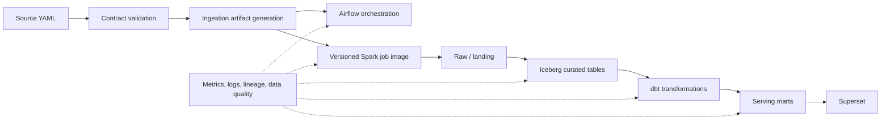

# DataLab Platform Evolution

Status: living roadmap  
Last updated: 2026-08-05

## Purpose

This document records the intended evolution of DataLab from a reproducible
local reference stack into a maintainable data platform. It describes target
capabilities, sequencing, architectural decisions, and completion criteria. It
is not a delivery schedule: dates and implementation issues should be tracked
separately.

## Current baseline

DataLab currently provides:

- Docker Compose deployment for HDFS, Hive, MinIO, Spark, Airflow, ClickHouse,
  and Superset;
- Python Spark jobs orchestrated by Airflow DAGs;
- raw data in MinIO, curated tables in Hive/HDFS, and serving tables in
  ClickHouse;
- local image builds with Spark jobs packaged into the Spark client image.

The main constraints are manual job delivery, source-specific ingestion code,
Spark code for mart construction, mutable Hive/Parquet tables, and limited
operational visibility.

## Guiding principles

1. **Configuration before duplication.** Repeated source-specific behavior
   should be expressed as validated configuration.
2. **Immutable delivery artifacts.** Every execution must be attributable to a
   Git commit and a versioned image or package.
3. **Contract-first ingestion.** Schema, ownership, freshness, and load
   semantics are declared before data is processed.
4. **Generated artifacts are deterministic.** The same configuration and code
   version must produce the same DAG and ingestion implementation.
5. **Observability is cross-cutting.** Metrics, logs, lineage, and data quality
   are introduced incrementally rather than postponed to the end.
6. **Local-first, production-shaped.** The platform remains runnable on one
   machine while adopting patterns that scale to shared environments.
7. **Reversible change.** New storage formats and delivery mechanisms require
   rollback and migration paths.

## Target direction



## Evolution track 1: job delivery

### Goal

Build, identify, distribute, and roll back Spark job artifacts without relying
on a developer workstation or the mutable `latest` tag.

### Target model

- CI builds a Spark job image when job code or runtime dependencies change.
- The image is tagged with the full or short Git SHA, for example:
  `ghcr.io/galkand/datalab-spark-jobs:f9c9a81`.
- Airflow reads the selected image from `SPARK_JOB_IMAGE`.
- The image tag, Git SHA, DAG run ID, and job name are emitted into logs and
  metrics.
- Releases promote an already-tested image; they do not rebuild it.
- Rollback means selecting a previously published image tag.

### Delivery increments

1. Parameterize the Spark image name and retain a local default.
2. Add unit tests, DAG import checks, and an image smoke test.
3. Build and push SHA-tagged images to GitHub Container Registry.
4. Add human-readable release tags without removing SHA tags.
5. Add dependency scanning, an SBOM, retention rules, and optional image
   signing.
6. Introduce a local development override with a relative bind mount for fast
   iteration; keep packaged jobs as the default execution mode.

### Definition of done

- a DAG run identifies the exact image and Git SHA it executed;
- a clean host can run a published image without the source checkout;
- rollback to a previous job version is documented and tested;
- CI rejects an image whose packaged job smoke test fails.

## Evolution track 2: YAML-driven ingestion

### Goal

Describe a new source declaratively and generate deterministic ingestion
artifacts instead of copying and editing a Python job and DAG.

### Proposed repository structure

```text
ingestion/
├── schema/source.schema.json
├── sources/
│   ├── yelp_business.yaml
│   └── yelp_review.yaml
├── generator/
├── templates/
└── generated/
```

### Example source contract

```yaml
version: 1
source:
  name: yelp_business
  owner: data-platform
  connection: minio_raw
  path: s3a://raw/yelp/business/full/
  format: json

load:
  mode: full
  schedule: null
  target: s3a://landing/yelp/business/
  write_format: parquet

schema:
  evolution: fail
  fields:
    - {name: business_id, type: string, nullable: false}
    - {name: name, type: string, nullable: true}

quality:
  freshness_hours: 24
  unique_key: [business_id]
  not_null: [business_id]
```

Credentials must not be stored in YAML. Contracts reference Airflow
Connections or another secret provider by logical name.

### Generation boundary

The generator should produce a small, reviewable manifest and DAG/job wrapper.
Reusable ingestion behavior belongs in a generic runtime library rather than
being copied into every generated Python file. Generated files must include a
header stating that they must not be edited manually.

### Delivery increments

1. Define and version the source contract schema.
2. Validate YAML in CI with clear path-level errors.
3. Convert one existing source as a reference implementation.
4. Generate a DAG and runtime manifest deterministically.
5. Compare generated output in CI and reject uncommitted drift.
6. Add incremental modes, watermarks, partitioning, and schema-evolution
   policies only after the full-load contract is stable.

### Definition of done

- adding a supported source requires YAML and tests, not copied orchestration
  code;
- invalid contracts fail before deployment;
- regeneration is deterministic and idempotent;
- schema and load-policy changes are visible in code review;
- source ownership and freshness expectations are queryable metadata.

## Evolution track 3: dbt for marts

### Goal

Move relational mart transformations, tests, and documentation from custom
Spark scripts into dbt while retaining Spark for ingestion and transformations
that genuinely require it.

### Decisions required

- Choose the primary execution target: dbt-spark/dbt-athena-style processing
  over curated Iceberg tables, or dbt-clickhouse for serving-layer marts.
- Define which layer owns business logic and prevent the same mart from being
  implemented in both Spark and dbt.
- Select an orchestration method: Airflow dbt task group, dbt CLI container, or
  a dedicated integration.

### Recommended starting point

Start with one existing mart and preserve its current output contract. Add dbt
source freshness, schema tests, model tests, and generated documentation. Run
the old and new implementations in parallel until row counts and agreed
business metrics match.

### Definition of done

- mart dependencies are represented by the dbt graph;
- business transformations are reviewed as SQL models;
- tests run in CI and during orchestration;
- model documentation and column descriptions are generated;
- migration includes output reconciliation and a rollback path.

## Evolution track 4: Apache Iceberg

### Goal

Replace mutable managed Parquet tables in the curated layer with tables that
support atomic commits, schema evolution, partition evolution, snapshot
history, and safer incremental processing.

### Initial scope

- Keep raw objects immutable in MinIO.
- Migrate curated/core tables first; do not migrate every layer at once.
- Use MinIO for table data and select a catalog explicitly. Hive Metastore can
  be the first catalog for the local stack; a REST catalog can be evaluated
  later.
- Pin compatible Spark, Iceberg runtime, Hadoop AWS, and catalog versions.

### Delivery increments

1. Record an ADR for catalog choice and warehouse layout.
2. Add Iceberg Spark extensions and a minimal smoke-test table.
3. Prove create, append, overwrite, merge, schema evolution, and time travel.
4. Migrate one core table with dual-write or repeatable backfill validation.
5. Add snapshot expiration, orphan-file cleanup, and small-file compaction.
6. Migrate remaining curated tables based on measured value.

### Definition of done

- failed writes do not expose partial table state;
- schema changes follow a documented compatibility policy;
- snapshot retention and maintenance jobs are automated;
- migration and rollback are tested with representative data volumes;
- dbt and Spark read the same catalog consistently.

## Evolution track 5: observability

### Goal

Make infrastructure health, pipeline execution, lineage, and data quality
visible enough to diagnose failures and enforce service expectations.

### Four signals

1. **Infrastructure:** container health, CPU, memory, storage, HDFS, MinIO,
   Spark, Airflow, ClickHouse, and database metrics.
2. **Execution:** run duration, queue time, retries, records processed, bytes,
   partitions, and failure category.
3. **Data quality:** freshness, volume, null rates, uniqueness, schema drift,
   and reconciliation checks.
4. **Lineage:** source contract to landing dataset, curated table, dbt model,
   and serving mart.

### Candidate stack

- Prometheus and Grafana for metrics and dashboards;
- structured container logs with Loki or another log backend;
- Airflow and Spark metrics exporters;
- OpenLineage with Marquez or a compatible lineage backend;
- dbt artifacts and tests for transformation metadata and quality;
- alert routing added only after actionable thresholds are defined.

### Delivery increments

1. Standardize structured log fields: environment, run ID, job, image SHA,
   source, target, and error class.
2. Add a platform health dashboard and basic resource alerts.
3. Emit job-level records/bytes/duration metrics.
4. Add contract-driven freshness and volume checks.
5. Add lineage events across ingestion, Spark, and dbt.
6. Define SLOs and alert ownership after baseline behavior is measured.

### Definition of done

- an operator can identify where and why a run failed without entering every
  container;
- dashboards link failures to logs and the executed code version;
- freshness and quality failures identify an owner;
- alerts are actionable and tested;
- observability components have bounded retention and resource usage locally.

## Recommended sequence

| Stage | Outcome | Depends on |
|---|---|---|
| 0. Foundation | reproducible startup, tests, CI baseline, structured logs | current platform |
| 1. Delivery | SHA-versioned Spark job images and rollback | stage 0 |
| 2. Ingestion contracts | validated YAML and one generated ingestion flow | stages 0-1 |
| 3. Iceberg pilot | one curated table with atomic lifecycle and maintenance | stages 0-2 |
| 4. dbt pilot | one reconciled mart built and tested with dbt | stage 3 or an explicit temporary target |
| 5. Scale-out | more sources, tables, and marts using proven patterns | successful pilots |

Observability starts in stage 0 and matures during every later stage; it is not
a final standalone migration.

## Architectural decision records

Material decisions should be captured under `docs/adr/`. Expected ADRs include:

1. Spark job artifact and image versioning strategy.
2. YAML generation versus runtime interpretation boundary.
3. Source contract schema and compatibility policy.
4. Iceberg catalog and warehouse layout.
5. dbt execution target and orchestration method.
6. Metrics, logs, lineage, and retention stack.

## Roadmap maintenance

- Each delivery increment should become a GitHub issue with an owner,
  dependencies, acceptance criteria, and validation evidence.
- Update this document when an ADR changes the target direction.
- Mark capabilities as adopted only after their definition of done is met.
- Prefer one representative pilot over broad partial implementation.
- Record deferred work and rejected alternatives rather than silently removing
  them.

